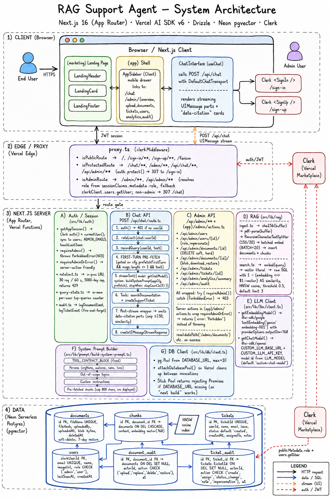

# RAG Support Agent

Serverless AI customer support agent built on Next.js 16, the Vercel AI
SDK v6, and Drizzle ORM on Neon Serverless Postgres with pgvector.
Users sign in with Clerk, ask questions in a chat UI, and receive
cited answers drawn from uploaded PDF documentation.

## Quick start

```bash
git clone <repo-url> && cd rag_agent
docker compose up -d db          # Postgres + pgvector
pnpm install && pnpm dev         # http://localhost:3000
```

That's it. The defaults in `.env.example` boot against the Docker
Postgres with Ollama for embeddings and chat — no external API keys
needed for local development.

> **Note:** You still need Clerk keys for auth (`CLERK_SECRET_KEY` and
> `NEXT_PUBLIC_CLERK_PUBLISHABLE_KEY`). Copy `.env.example` to
> `.env.local` and add them. Without Clerk, the app boots but you
> can't sign in.

### Zero-key local (with Ollama)

```bash
docker compose --profile ollama up -d   # Postgres + Ollama
# Pull the models (first time only):
docker compose exec ollama ollama pull nomic-embed-text
docker compose exec ollama ollama pull llama3.1
pnpm install && pnpm dev
```

### Deploy to Vercel

1. Push to GitHub.
2. Import the repo in Vercel.
3. Add environment variables from `.env.example` — see the
   "Getting your API keys" section below for where to get each one.
4. Deploy. Migrations run automatically during `pnpm build`.

### Getting your API keys

Every service the app needs is listed below, with where to sign up,
what to copy, and free-tier notes. For local-only development you can
skip every service except **Clerk** — Docker provides Postgres and
Ollama replaces the LLM providers.

| Service | Required for | Where to sign up | Free tier |
|---------|-------------|------------------|-----------|
| Clerk | Auth (always) | https://dashboard.clerk.com | Yes — generous free tier |
| Neon | Prod DB | https://neon.tech | Yes — 0.5 GB, auto-suspend |
| Google AI Studio | Prod embeddings | https://aistudio.google.com/apikey | Yes — free embeddings |
| OpenAI-compatible chat | Prod chat | Your provider (OpenAI, OpenRouter, Groq, etc.) | Varies |
| Cloudflare R2 | Prod blob storage | https://dash.cloudflare.com → R2 | Yes — 10 GB, zero egress |
| Upstash Redis | Prod rate limiting | https://console.upstash.com | Yes — 10k commands/day |
| Upstash QStash | Async ingest (optional) | https://console.upstash.com → QStash | Yes — 500 msgs/day |

#### Clerk (auth — always required, even locally)

1. Go to https://dashboard.clerk.com → **Create application**.
2. Name it (e.g. "RAG Support Agent"). Select your preferred sign-in
   methods (Email + Google at minimum).
3. From the application's **API Keys** page, copy:
   - `NEXT_PUBLIC_CLERK_PUBLISHABLE_KEY` — starts with `pk_test_`
     (development) or `pk_live_` (production). The `NEXT_PUBLIC_`
     prefix means it's safe to expose to the client.
   - `CLERK_SECRET_KEY` — starts with `sk_test_` or `sk_live_`. **Never
     commit this.**
4. **Set up the JWT template (required for the role fast-path in
   `proxy.ts`)**: Dashboard → **Sessions** → **Customize session token**
   → set the template body to:
   ```json
   { "metadata": "{{user.public_metadata}}" }
   ```
   This projects `publicMetadata.role` into the session token's
   `metadata.role` claim, which the middleware reads without calling
   the Clerk Backend SDK on every request.
5. **For Vercel Marketplace auto-provision** (optional but convenient):
   In the Vercel dashboard → Storage → Marketplace → add Clerk. This
   auto-sets both keys in your Vercel project env vars.

#### Neon (prod database)

1. Go to https://neon.tech → **Sign up** (GitHub/Google).
2. **Create a project** → name it → select the region closest to your
   Vercel deployment region (e.g. `us-east-1` if Vercel is `iad1`).
3. Copy the **pooled connection string** (uses port `6543`, hostname
   `-pooler`); this goes into `DATABASE_URL`. It should end with
   `?sslmode=require`.
4. **Enable pgvector**: open the Neon SQL editor and run:
   ```sql
   CREATE EXTENSION IF NOT EXISTS vector;
   ```
5. For preview deploys: copy `NEON_API_KEY` (Settings → API keys) and
   `NEON_PROJECT_ID` (Settings → Project ID). When both are in Vercel
   env vars, `pnpm test:ci` provisions a per-branch Neon database for
   each Vercel preview deploy.

#### Google AI Studio (prod embeddings)

1. Go to https://aistudio.google.com/apikey → **Create API key**.
2. Copy the key into `AI_STUDIO_KEY`.
3. The default model `gemini-embedding-001` produces 768-dim vectors —
   matches the pgvector column. Don't change `EMBEDDING_DIMENSION`
   unless you switch to a different embedding model.

#### OpenAI-compatible chat (prod chat)

The app uses `@ai-sdk/openai`'s `createOpenAI`, so any
OpenAI-compatible endpoint works (OpenAI, OpenRouter, Groq, Together,
local LM Studio, etc.).

1. Get an API key from your provider.
2. Set `CUSTOM_LLM_API_KEY` = the key.
3. Set `CUSTOM_LLM_BASE_URL` = the endpoint (e.g.
   `https://api.openai.com/v1`, `https://openrouter.ai/api/v1`).
4. Set `LLM_MODEL` = the model id (e.g. `gpt-4o-mini`,
   `anthropic/claude-3.5-sonnet` for OpenRouter).

#### Cloudflare R2 (prod blob storage)

1. Go to https://dash.cloudflare.com → **R2 Object Storage** (sign up
   if needed; requires a Cloudflare account + payment method on file
   even for the free tier).
2. **Create a bucket** — name it (e.g. `rag-agent-docs`). Note the
   region (auto is fine).
3. **Create an API token**: R2 → **Manage R2 API Tokens** → **Create
   API Token** → permissions: **Object Read & Write** on your bucket.
   Copy:
   - `R2_ACCESS_KEY_ID` — the access key id
   - `R2_SECRET_ACCESS_KEY` — the secret access key
4. `R2_ACCOUNT_ID` = your Cloudflare account ID (visible in the
   dashboard sidebar or URL).
5. `R2_BUCKET` = the bucket name you created.
6. **CORS** (needed if the PDF preview route redirects to a signed
   R2 URL that the browser fetches): R2 → your bucket → **Settings** →
   **CORS Policy** → add:
   ```json
   [{
     "AllowedOrigins": ["https://your-app.vercel.app", "http://localhost:3000"],
     "AllowedMethods": ["GET", "HEAD"],
     "AllowedHeaders": ["*"],
     "ExposeHeaders": ["Content-Length", "Content-Type"],
     "MaxAgeSeconds": 3600
   }]
   ```
7. If the CSP in `next.config.ts` blocks the R2 domain in `frame-src`
   or `img-src`, add `https://*.r2.dev` (or your custom R2 domain) to
   those directives.

#### Upstash Redis (prod rate limiting + query stats)

1. Go to https://console.upstash.com → **Create Database**.
2. Name it, select the **same region** as your Vercel deployment
   (latency matters — every `/api/chat` call hits Redis).
3. Copy:
   - `UPSTASH_REDIS_REST_URL` — the REST URL (ends with `.upstash.io`)
   - `UPSTASH_REDIS_REST_TOKEN` — the REST token
4. Without these, the app falls back to in-memory rate limiting — fine
   for local dev, but on Vercel each instance gets its own limit (N×
   the intended budget). Set these for any multi-instance deploy.

#### Upstash QStash (async ingest — optional)

1. Go to https://console.upstash.com → **QStash**.
2. Copy:
   - `QSTASH_TOKEN` — from the QStash dashboard
   - `QSTASH_CURRENT_SIGNING_KEY` and `QSTASH_NEXT_SIGNING_KEY` —
     from **Settings** → **API Keys**. These two are used for
     signature rotation; the worker verifies with both so a key
     rotation doesn't break in-flight messages.
3. Set `QSTASH_INGEST_WORKER_URL` = the public URL of your deployment
   (e.g. `https://your-app.vercel.app`). QStash calls back over the
   public internet, so localhost won't work — use a Vercel preview or
   production URL.
4. Without `QSTASH_TOKEN`, all uploads go through the synchronous path
   (≤4 MB, blocks until ingest completes). Fine for small docs.

## Stack

- **Framework:** Next.js 16 (App Router) with Turbopack
- **Auth:** Clerk (`@clerk/nextjs` v7) via Vercel Marketplace; Next 16
  `proxy.ts` (the renamed `middleware.ts`) for route gating
- **LLM:** Google AI Studio `gemini-embedding-001` (free 768-dim
  embeddings) + any OpenAI-compatible chat endpoint via
  `CUSTOM_LLM_*` env vars
- **Database:** Neon Serverless Postgres with the `pgvector` extension
  and HNSW cosine index
- **ORM:** Drizzle
- **Tooling:** Vitest, Testing Library, `drizzle-kit`
- **UI:** Dark "obsidian slate" theme via CSS custom properties in `src/app/globals.css` (no light variant). Route groups split the app: `(marketing)` for the public landing, `(app)` for the unified sidebar + mobile-drawer shell that wraps `/chat` and `/admin/*`.

## Reference

### Identity, auth, and roles

- **Provider:** Clerk (Vercel Marketplace). The integration auto-provisions
  `CLERK_SECRET_KEY` and `NEXT_PUBLIC_CLERK_PUBLISHABLE_KEY`.
- **Sign-in:** `/sign-in` and `/sign-up` use Clerk's hosted `<SignIn />` /
  `<SignUp />` components. Email+password and Google are enabled in the
  Clerk dashboard; the app is provider-agnostic.
- **Role model:** Every Clerk user has `publicMetadata.role` of `admin`
  or `user`. The local `users` table is the single source of truth for
  roles; Clerk's `publicMetadata` is kept in sync as a secondary store
  for JWT-based middleware checks.
- **Bootstrap:** `ADMIN_EMAILS` is a comma-separated env var. The first
  time a user with one of those emails signs in, they are auto-promoted
  to `admin` in the local DB and the role is synced back to Clerk's
  `publicMetadata`. After that, admins promote others from `/admin/users`.
- **Route gating:** `src/proxy.ts` runs `clerkMiddleware`. `/chat(.*)`,
  `/admin(.*)`, `/api/chat(.*)`, and `/api/admin(.*)` require a signed-in
  user; `/admin(.*)` and `/api/admin(.*)` additionally require
  `role === 'admin'` (non-admins are redirected to `/chat`).
- **JWT template:** To enable fast role checks in middleware without
  hitting the Clerk Backend SDK on every request, configure a JWT
  template in the Clerk Dashboard (Sessions → Customize session token):
  `{ "metadata": "{{user.public_metadata}}" }`. This projects
  `publicMetadata.role` into the session token's `metadata.role` claim,
  which `src/proxy.ts` reads as its fast path. Without this template,
  the middleware falls back to a Backend SDK call on every request.
- **Action gating:** Every admin server action and API route calls
  `requireAdmin()` as its second line. Server actions return
  `{ error: 'Forbidden' }`; API routes return HTTP 403.
- **Security headers:** `next.config.ts` sets `X-Frame-Options: SAMEORIGIN`,
  `X-Content-Type-Options: nosniff`, `Referrer-Policy`,
  `Strict-Transport-Security` (HSTS), `Permissions-Policy`, a
  `Content-Security-Policy` header, and disables the `X-Powered-By`
  header. Server actions have a 4 MB `bodySizeLimit`.

### Admin console

- **`/admin` (Overview)** — Counts of docs, chunks, tickets, open
  tickets, and users, plus the latest 10 audit events.
- **`/admin/upload`** — File picker. After a successful upload shows the
  chunk count and links to the new row in Documents.
- **`/admin/documents`** — Searchable, paginated table. Each row has
  *Preview* (inline iframe over `/api/admin/documents/[id]/blob`),
  *Download*, *Replace*, *Delete* (soft delete with 7-day restore
  window), and *Hard delete* (cascade). A page-level *Recount all*
  button re-derives every document's chunk count from the
  `chunks` table (the `recountAllChunksAction` server action).
- **`/admin/tickets`** — Searchable, paginated list. The table is
  `table-fixed` with bounded column widths and a compact
  `YYYY-MM-DD HH:mm` Created column so it never overflows the
  viewport — no horizontal page scroll. Each row links to
  `?ticket=...`, which a client-side overlay (`ticket-overlay.tsx`)
  reads via `useSearchParams` and renders the existing `TicketDrawer`
  body into a portal: the full issue, a notes thread, a status
  select, an assignee select, and an "Add note" textarea. Status
  transitions are validated (no `closed → created/in_progress`).
  Ticket IDs are UUID-based (`TKT-<8-hex-chars>`) to avoid
  race conditions on concurrent creation.
- **`/admin/users`** — Searchable, paginated list of all Clerk users.
  Per-row *Promote / Demote* buttons.
- **`/admin/analytics`** — Read-only counts and an in-process top-queries
  table.
- **`/admin/audit`** — Full audit log filterable by document id or
  ticket id. Document audit events: upload, replace, delete, restore.
  Ticket audit events: create, assign, status_change, note,
  role_change.

### Rate limit

`packages/infrastructure/src/auth/lru-rate-limiter.ts` is a single-instance,
in-memory sliding-window limiter keyed by `chat:${userId}`. Default budget:
30 requests / 60 s, max 5 000 keys. Periodic eviction prunes stale entries
in batches to avoid O(n) scans. The 31st request returns HTTP 429 with a
`Retry-After` header. When the app moves to a multi-region deployment, swap
this for an Upstash hash; the call sites do not need to change.

### Shared utilities

| File | Purpose |
| --- | --- |
| `config/constants.ts` | Centralised business-logic constants (rate limits, thresholds, batch sizes) |
| `src/lib/sanitize.ts` | `escapeHtml()` and `sanitizeText()` for user-supplied free-text fields |
| `src/lib/logger.ts` | Lightweight structured JSON logger with `LOG_LEVEL` env gate (replace with pino for richer features) |
| `src/lib/http.ts` | `respond()`, `respondResult()`, `toSafeError()`, `toActionResult()`, and `isActionError()` for consistent error mapping |

### Scripts

| Script | What it does |
| --- | --- |
| `pnpm configure` | One-command interactive setup wizard (prompts for env vars, migrates DB, seeds docs, runs smoke test) |
| `pnpm dev` | Run Next.js in dev mode |
| `pnpm build` | Run migrations then production build |
| `pnpm start` | Run the production build |
| `pnpm lint` | ESLint |
| `pnpm typecheck` | `tsc --noEmit` |
| `pnpm test` | Vitest unit + integration suite |
| `pnpm test:ui` | Vitest with the interactive UI |
| `pnpm test:ci` | Provision test DB + vitest suite (skipped when `NEON_API_KEY` is absent) |
| `pnpm db:push` | Apply the Drizzle schema to the configured DB (interactive) |
| `pnpm db:generate` | Generate SQL migrations from `packages/infrastructure/src/db/schema.ts` |
| `pnpm db:studio` | Drizzle Studio |
| `pnpm db:migrate` | Run Drizzle migrations (`tsx scripts/migrate.ts`) |
| `pnpm dev:db` | Start the local Docker Postgres (`docker compose up -d db`) |
| `pnpm dev:ollama` | Start the local Ollama container (`docker compose --profile ollama up -d ollama`) |
| `pnpm cli` | Run the `rag-agent` CLI dispatcher (`--help` for usage) |
| `pnpm cli init` | Interactive first-time setup: org name, agent persona, admin emails, seed PDFs. Writes `config/app.config.ts` and re-seeds. |
| `pnpm cli seed` | Ingest every PDF in `./documents/` (overridable via `SEED_DOCS_DIR` or `--dir`) |
| `pnpm cli db-migrate` | Apply the Drizzle schema + enable pgvector + add-column migrations |
| `pnpm arch` | Architecture boundary check via dependency-cruiser |

### Tests

#### Unit + integration (Vitest)

192 tests across 21 files. Run with `pnpm test` (single run) or
`pnpm test:ui` (interactive). Highlights:

- `src/app/api/chat/route.test.ts` — 401 / 429 paths, the
  `searchDocumentation` and `createSupportTicket` tool wiring
  (searchChunks shape, 800-char cap, user-supplied limit, captured-
  citation emission), the Clerk identity override in
  `createSupportTicket`, and the first-turn pre-fetch (no header on
  empty `lastUserText`, chunks injected on the first turn,
  pre-fetched chunks surface as `data-citation` parts without a
  tool call, no pre-fetch on follow-up turns)
- `src/app/api/admin/documents/[id]/blob/route.test.ts` —
  inline PDF preview route (auth + content-type + 404 paths)
- `src/app/api/admin/tickets/[ticketId]/route.test.ts` —
  single-ticket GET/PATCH (auth + 404 + status validation + notes update)
- `src/app/api/admin/users/[clerkId]/role/route.test.ts` —
  role update route (auth + invalid role + forbidden + happy path)
- `src/components/ChatInterface.test.tsx` — chat frame layout
  (`flex-1 min-h-0 overflow-y-auto`) + streaming / citations
  rendering
- `src/app/api/admin/{users,documents,tickets}/...` — 403 / 400 / 404 /
  409 paths and the happy path
- `src/app/(app)/admin/actions.test.ts` — every admin server action 403s for
  non-admin and forwards the right shape on success
- `src/proxy.test.ts` — middleware route gating (public / signed-in /
  admin)
- `packages/application/src/rag/__tests__/search.test.ts` —
  vector search error propagation and success path
- `packages/application/src/rag/__tests__/ingest.integration.test.ts` —
  PDF ingest pipeline: chunk insertion, hash dedup, transactional
  document replacement (delete-before-insert with TransactionRunner),
  empty-text and API-failure error paths
- `packages/application/src/auth/__tests__/users.test.ts` —
  `setUserRole`: audit logging, invalid role, user-not-found
- `packages/application/src/admin/__tests__/tickets.test.ts` —
  `updateTicket`: missing ticket, invalid transition, race condition,
  notes-only update, valid transitions; `createTicket`: generated ID,
  audit logging, insert failure; `isTicketStatus`, `VALID_TRANSITIONS`
- `packages/application/src/admin/__tests__/documents.test.ts` —
  `restoreDocument`: missing doc, non-deleted, expired window,
  within window; `softDeleteDocument`: missing doc, happy path
- `src/lib/__tests__/http.test.ts` — `respond()` edge cases
  (ConflictError→409, GoneError→410, ExternalServiceError→502,
  non-Error→500), `isActionError`, `toActionResult`, `toSafeError`
- `src/__tests__/composition.test.ts` — `parseQueryPagination` edge
  cases (empty string, Infinity, negative offset, zero offset),
  `parsePageParam`

### Architecture

<p align="center">
  <a href="public/SysArch.png">
    
  </a>
</p>

> End-to-end view: the four lanes (Client → Edge/Proxy → Next.js Server → Neon Postgres) and the cross-lane flows (request, data/SQL, UI message stream, auth/JWT) that connect them. See the full breakdown below.

```
src/
├── app/
│   ├── (marketing)/        # Public landing (no app chrome)
│   │   ├── layout.tsx
│   │   └── page.tsx
│   ├── (app)/              # Authenticated shell (sidebar + mobile drawer)
│   │   ├── layout.tsx
│   │   ├── chat/page.tsx
│   │   └── admin/          # requireAdmin() guard + admin pages + actions
│   ├── api/{chat,admin}/   # Tool-driven RAG + admin API routes
│   ├── sign-in/[[...sign-in]]/page.tsx
│   ├── sign-up/[[...sign-up]]/page.tsx
│   ├── layout.tsx          # ClerkProvider, html/body, fonts
│   └── globals.css         # Dark "obsidian slate" CSS tokens
├── components/
│   ├── ChatInterface.tsx
│   ├── app/AppSidebar.tsx  # Unified sidebar + mobile drawer (Client)
│   ├── landing/            # LandingHeader, LandingCard, LandingFooter
│   └── icons/GithubIcon.tsx
├── lib/
│   ├── http.ts             # respond() + respondResult() + toSafeError() + toActionResult()
│   ├── logger.ts           # Structured JSON logger
│   ├── sanitize.ts         # escapeHtml() + sanitizeText()
│   └── config/             # App-level config types
├── proxy.ts                # clerkMiddleware (Next 16 convention)
└── ...
config/
├── app.config.ts           # Org name, persona, admin emails, out-of-scope topics
└── constants.ts            # Centralised business-logic constants
scripts/                    # setup, seed, migration scripts
```

#### CI

`pnpm test:ci` provisions a Neon test branch, runs the full Vitest
suite, and tears the branch down. Requires `NEON_API_KEY` and
`NEON_PROJECT_ID` in `.env.local`. When these are absent the
branching step is skipped and the suite runs against whatever
database `DATABASE_URL` points to.

### Workspace layout

The business logic has been split into a 4-layer Clean Architecture
inside `packages/`:

```
packages/
├── domain/         # @app/domain — pure types, Zod schemas,
│                   #   Result<T,E>, DomainError hierarchy,
│                   #   port interfaces (repositories, services)
├── application/    # @app/application — use-cases that return
│                   #   Result<T, DomainError>. Imports only domain.
├── infrastructure/ # @app/infrastructure — Drizzle repos, AI SDK
│                   #   adapters, Clerk session, pdf-parse, bytea.
│                   #   Imports domain only (not application).
├── cli/            # @app/cli — `rag-agent` sub-commands:
                    #   init, setup, seed, db-migrate
```

`src/` is the Next.js app shell. `src/composition.ts` is the only
place where adapters are instantiated; routes import from
`@/composition` and call the use-cases.

#### Layer rules (enforced by `pnpm arch`)

| Layer            | May import                                | May NOT import                |
|------------------|-------------------------------------------|-------------------------------|
| `domain`         | zod                                       | application, infrastructure, cli, src/, drizzle, @ai-sdk, pdf-parse, next, node: built-ins |
| `application`    | domain, config/constants                  | infrastructure, src/app, src/components, drizzle, @ai-sdk, pdf-parse, next |
| `infrastructure` | domain, drizzle, @ai-sdk, clerk, pdf-parse, pg | application, src/app, src/components, next |
| `src/app`, `src/components` | application, domain, src/lib/http, src/lib/config | drizzle, @ai-sdk, pdf-parse, infrastructure |
| `cli`            | application, infrastructure, dotenv       | src/app, src/components |

Run `pnpm arch` after any change that touches the import graph.

#### Boundary validation

Every route handler and server action parses its external input
through a Zod schema before it reaches a use-case:

- `src/lib/config/index.ts` — validates `config/app.config.ts` at server start
- `src/app/api/chat/request-schema.ts` — POST `/api/chat` body
- `src/app/api/admin/*/route.ts` — request bodies and URL params
- Server actions in `src/app/(app)/admin/actions.ts` — form input

Environment variables are validated at the point of use in each
infrastructure adapter:

- `packages/infrastructure/src/db/pool.ts` — validates `DATABASE_URL`
- `packages/infrastructure/src/llm/google-embedding-service.ts` — validates `AI_STUDIO_KEY`
- `packages/infrastructure/src/llm/openai-chat-service.ts` — validates `CUSTOM_LLM_API_KEY`, `CUSTOM_LLM_BASE_URL`
- `packages/infrastructure/src/auth/session.ts` — parses `ADMIN_EMAILS`
- `src/lib/logger.ts` — gates on `LOG_LEVEL`

Use-cases return `Result<T, DomainError>`; `src/lib/http.ts` exports
`respond(result)` which maps `DomainError` to the right HTTP status
(ValidationError → 400, UnauthorizedError → 401, ForbiddenError → 403,
NotFoundError → 404, ConflictError → 409, GoneError → 410,
RateLimitedError → 429 with `Retry-After`, ExternalServiceError → 502).
